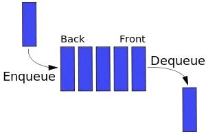

# Queue

Queue follows the principle of FIFO (First In First Out).
In other words, when you queue for bus, the first in the queue will always board first.

It has some common methods:

- enqueue: enter queue, add an element at the end.
- dequeue: leave queue, remove the front element and return it.
- front: get the first element.
- isEmpty: determine whether the queue is empty.
- size: get the number of element(s) in queue.

---

    

