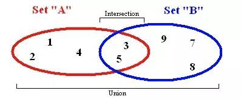

# Set

A set is a basic concept in mathematics: a collection of well defined and distinct objects. ES6 introduced the concept of set, which has certain level of similarity with array. However, a set does not allow repeating elements and is not indexed.

It has some common methods:

- values: return all elements in a set.
- size: return the number of element.
- has: determine whether an element exists.
- add: insert elements into set.
- remove: delete elements from set.
- union: return the intersection of two sets.
- difference: return the difference of two sets.
- subset: determine whether a certain set is a subset of another set.

---

    

